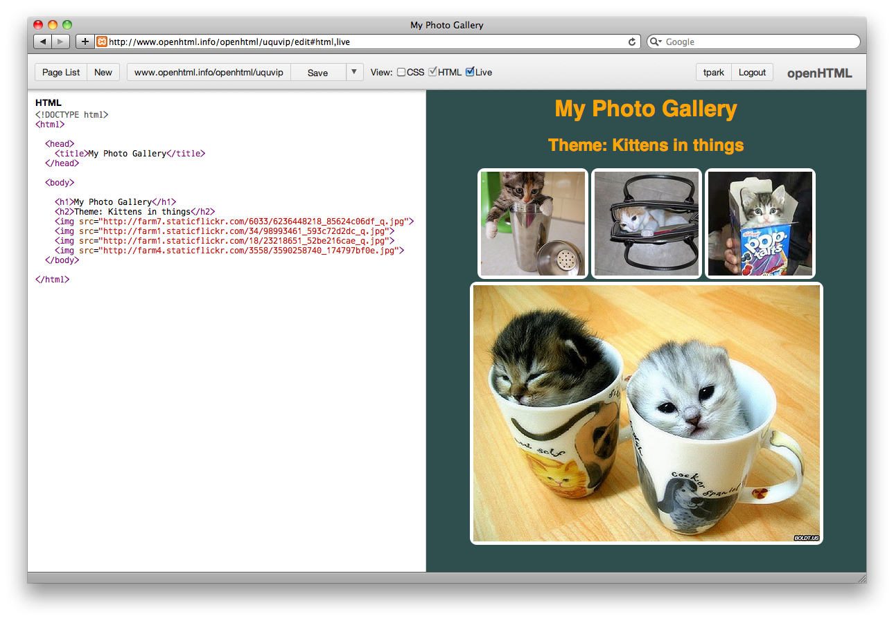

# openHTML

openHTML is a web-based HTML and CSS editor geared toward beginners learning basic web development. It offers:

* A simplified interface to put the focus on coding.
* Live previews for instantaneous feedback.
* User accounts to save pages 
* Revision control for fearless experimentation.
* Seeding, sharing, and forking of pages.

Over time, features will be added that enhance the pedagogical aspects of the environment.

## About

openHTML is based on [JS Bin](https://github.com/remy/jsbin), made by the inimitable [Remy Sharp](http://remysharp.com).